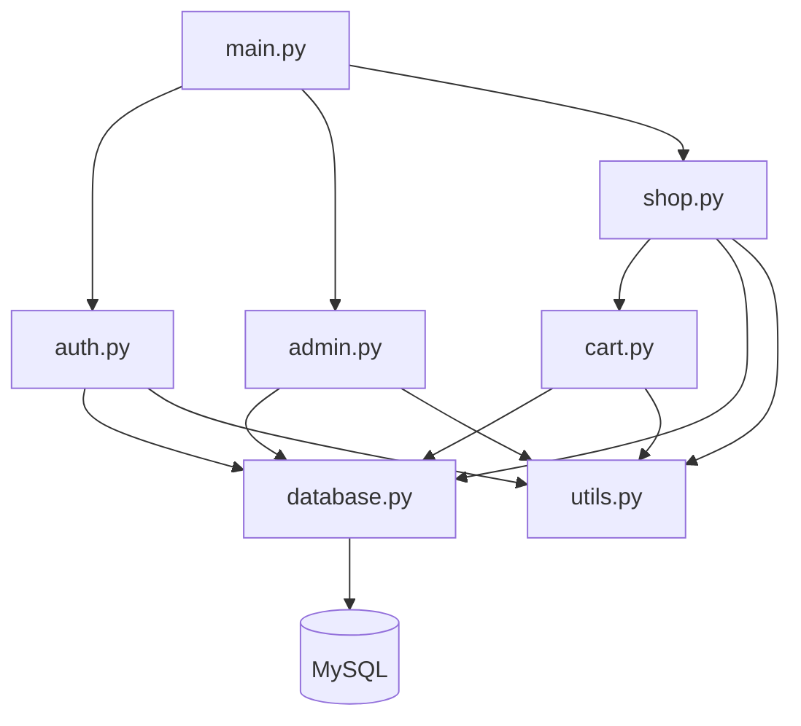
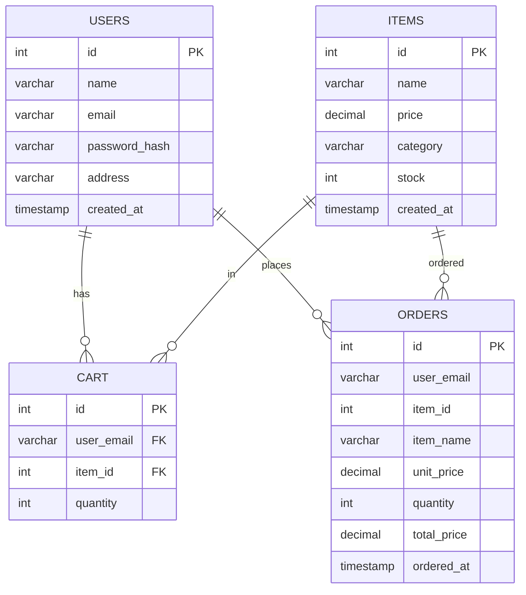

# Shopping Cart

A terminal-based shopping cart application built with Python and MySQL. Supports user registration, product browsing by category or search, cart management, checkout, and order history. Admins manage the full product catalog through a dedicated admin panel.

## Features

- User registration and login with SHA-256 hashed passwords
- Browse products by category (Electronics, Grocery, Toys, Clothing)
- Search products by name
- Persistent per-user shopping cart
- Cart management: add, update quantity, remove items
- Checkout with automatic stock deduction and order recording
- Full order history with lifetime spend summary
- Admin panel for product and user management
- Environment-based configuration via `.env`

## Tech Stack

- **Language:** Python 3.8+
- **Database:** MySQL 8.0+
- **Libraries:** `mysql-connector-python`, `prettytable`, `python-dotenv`

## Architecture



## Database Schema



## Setup

### Prerequisites

- Python 3.8 or higher
- MySQL 8.0 or higher

### Installation

1. Clone the repository:

   ```bash
   git clone https://github.com/punyamodi/Shopping-Interface.git
   cd Shopping-Interface
   ```

2. Install dependencies:

   ```bash
   pip install -r requirements.txt
   ```

3. Copy `.env.example` to `.env` and fill in your MySQL credentials:

   ```bash
   cp .env.example .env
   ```

4. Run the application:

   ```bash
   python main.py
   ```

The application automatically creates the database and all required tables on first run.

## Configuration

| Variable      | Default         | Description        |
|---------------|-----------------|--------------------|
| `DB_HOST`     | `localhost`     | MySQL host         |
| `DB_USER`     | `root`          | MySQL username     |
| `DB_PASSWORD` | _(empty)_       | MySQL password     |
| `DB_NAME`     | `shopping_cart` | Database name      |

## Usage

### User

| Action         | Description                                              |
|----------------|----------------------------------------------------------|
| Create Account | Register with name, email, password, and address         |
| Login          | Access your personal cart and order history              |
| Browse         | Filter products by category or search by name            |
| Cart           | Add items, adjust quantities, or remove them             |
| Checkout       | Place order, deduct stock, and save to order history     |
| Order History  | View all past orders with per-order and lifetime totals  |

### Admin

Login with:

- **Email:** `admin@admin.com`
- **Password:** `admin123`

| Action          | Description                                          |
|-----------------|------------------------------------------------------|
| Add Item        | Insert a new product with price, category, and stock |
| Remove Item     | Delete a product with confirmation                   |
| Update Price    | Change the price of any item                         |
| Update Category | Reassign an item to a different category             |
| Update Name     | Rename an existing item                              |
| Update Stock    | Adjust the available stock count                     |
| View All Items  | Display the full product catalog                     |
| View All Users  | List all registered users                            |

## Project Structure

```
Shopping-Interface/
├── main.py           # Application entry point
├── config.py         # Environment-based configuration
├── database.py       # Connection management and schema setup
├── auth.py           # Login and registration
├── admin.py          # Admin product management panel
├── shop.py           # Browsing and shopping interface
├── cart.py           # Cart and checkout operations
├── utils.py          # Display and input utilities
├── schema.sql        # SQL schema for manual setup
├── requirements.txt  # Python dependencies
├── .env.example      # Environment variable template
└── .gitignore
```
